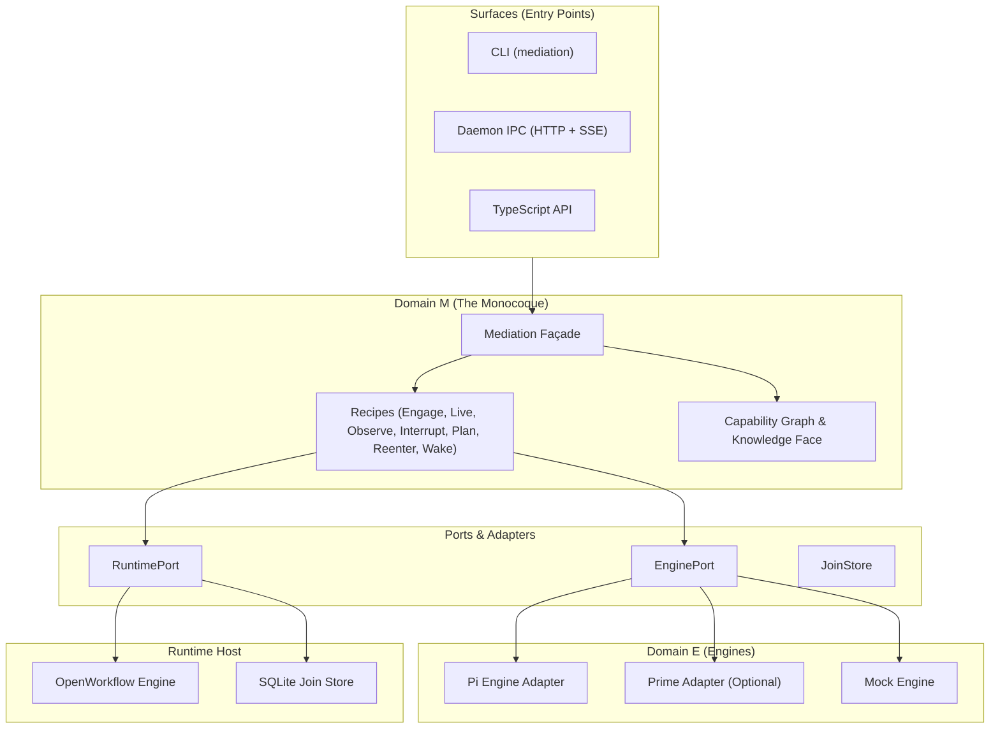

# @rethink-paradigms/mediation

[](https://opensource.org/licenses/MIT)
[](https://nodejs.org)
[](https://github.com/rethink-paradigms/mediation)
[](./TOOLING.md)

The **Agent Presence Monocoque** — a medium-independent substrate that turns inert agent definitions into living **Presences**, providing durable lifecycle management, swappable execution engines, and capability discovery.

Every engagement in the mediation engine concludes cleanly in one of three terminal states: **Settled**, **Parked**, or **Failed**.

---

## Why Mediation Engine?

Modern AI agent architectures suffer from three systemic issues:
1. **Engine Lock-In**: Code written for one harness (e.g. Pi, Prime, LangChain) cannot easily run on another without rewriting session lifecycle, tool resolution, and streaming hooks.
2. **Fragile State & Broken Turns**: When an agent pauses to await human input, asynchronous jobs, or external webhooks, long-lived processes waste memory or drop execution context when interrupted.
3. **Implicit Tool Couplings**: Agent capabilities are often hardcoded to filesystem paths rather than portable capability identities.

**Mediation Engine solves this with a single architectural monocoque:**
* **One Door (`createLocalMediation` / `createHostedMediation`)**: A single unified materializer transforms definitions into active Presences.
* **Two Territories**: Engine mechanics (Domain E) and agent definitions (Domain A) never leak into each other; Domain M mediates between them.
* **First-Class Park & Wake**: An agent can **Park** its cognitive state durably into SQLite/OpenWorkflow, freeing execution resources until a **Wake** signal resumes the exact session.
* **Pluggable Engine Harnesses**: Run on top of **Pi** (`@earendil-works/pi-coding-agent`), **Prime** (optional via `prime-agent`), or deterministic **Mock** minds.
* **Domain M Knowledge Face**: A capability graph providing `list`, `describe`, `resolve`, `validate`, `compose`, and `explain` over tools and fleet agents.

---

## Architecture



---

## Quickstart

### Installation

```bash
npm install @rethink-paradigms/mediation
```

> **Optional Engine Harness**: If you want to use the Prime engine harness, install `prime-agent` in your project:
> ```bash
> npm install prime-agent
> ```

### 1. In-Process Engagement (Local Façade)

```typescript
import { createLocalMediation } from "@rethink-paradigms/mediation";

const mediation = createLocalMediation();

// Engage an agent definition
const result = await mediation.engageLocal({
  definition: {
    id: "my-assistant",
    name: "Assistant",
    rootDir: process.cwd(),
    model: "anthropic/claude-3-5-sonnet",
    prompt: "You are a helpful, rigorous engineering assistant.",
  },
  task: "Review the system architecture documentation.",
});

console.log("Outcome:", result.outcome.kind); // "settled" | "parked" | "failed"
console.log("Session Reference:", result.sessionRef);
```

### 2. Durable Hosted Execution (Park & Wake)

With hosted mediation, runs are durable across restarts and system crashes:

```typescript
import { createHostedMediation } from "@rethink-paradigms/mediation";

const hosted = await createHostedMediation({
  dbPath: "./mediation.sqlite",
});

// Dispatch an engagement workflow
const { runId } = await hosted.dispatch({
  definition: myAgentDefinition,
  task: "Await customer approval on invoice #1042",
});

// Check status (can report "running", "parked", or "completed")
const status = await hosted.status(runId);

// Wake a parked engagement with user input
if (status.parked) {
  await hosted.wake({
    runId,
    text: "Customer approved the invoice.",
    mode: "continue",
  });
}

// Wait for final settlement
const outcome = await hosted.wait(runId);
console.log("Final outcome:", outcome);
```

### 3. Command Line Interface (CLI)

The package exports the `mediation` binary:

```bash
# Direct local engagement
npx mediation engage --agent ./agents/reviewer --task "Audit pull request #42"

# Durable dispatch with hosted runtime
npx mediation dispatch --agent ./agents/reviewer --task "Long running research" --wait

# Inspect run status
npx mediation status --run-id <runId>

# Wake a parked run
npx mediation wake --run-id <runId> --text "Here is the requested credential"

# Choose engine kind (pi | prime | mock)
npx mediation engage --agent ./agents/reviewer --task "Run probe" --engine mock
```

### 4. Daemon Control Plane (HTTP + SSE)

The mediation engine includes a background IPC server providing real-time Server-Sent Events (SSE) and HTTP endpoints over Unix domain sockets:

```bash
# Connect CLI to a running daemon over IPC socket
npx mediation status --run-id <runId> --ipc unix:/tmp/mediation.sock
```

---

## Documentation

* [Architecture & Domain M](./docs/ARCHITECTURE.md) — Comprehensive guide to the monocoque, capability graphs, and layer laws.
* [CLI & Daemon Reference](./docs/CLI.md) — Exhaustive CLI subcommands, flags, IPC sockets, and SSE event streaming.
* [Engine Adapters](./docs/ENGINES.md) — Configuring Pi, Prime (optional), and custom engines.
* [Contributing & Quality Gates](./CONTRIBUTING.md) — Development workflow, testing doctrine, and architectural gauges.

---

## Verification & Quality Gates

This package enforces strict zero-tolerance architectural invariants:

```bash
npm run check
```

`npm run check` automatically executes:
1. **TypeScript compilation**: Native zero-emit typecheck via `tsgo --noEmit`.
2. **Linter**: `oxlint` with strict security, import, and correctness rules.
3. **Test Suite**: Native Node test runner with 502 unit, integration, and runtime tests.
4. **Architectural Gauges**:
   - `layer_import_violations`: Guarantees Domain and Ports never import adapters or engines.
   - `second_door_count`: Guarantees agent sessions are created only through authorized factory doors.
   - `export_integrity`: Guarantees zero symbol leaks.
   - `pack_parity_delta`: Enforces deterministic capability hash snapshots.

---

## License

[MIT](./LICENSE) © 2026 rethink-paradigms
